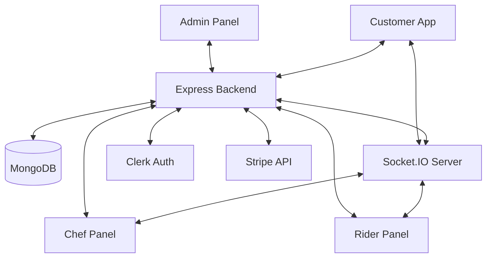

# 🌑 AK-7 REST — Project Technical Overview

**Version**: 1.0.0
**Core Stack**: MERN (MongoDB, Express, React, Node.js)
**Design Philosophy**: Midnight Gourmet (Premium, Dark Mode, High-End Visuals)

---

## 🏗️ System Architecture

AK-7 REST is designed as a **decoupled micro-frontend** ecosystem powered by a centralized **Real-Time Backend Gateway**. This multi-modal architecture ensures that specific user groups (Customers, Admins, Chefs, and Riders) have specialized, high-performance interfaces while sharing a single source of truth (MongoDB).

---

## 📂 Detailed Folder Breakdown

### 1. ⚙️ Root Directory
The root level handles repository-wide configuration and deployment settings.
- `package.json`: Contains workspace dependencies and scripts.
- `vercel.json`: Configuration for edge-deployment of frontend modules.
- `README.md`: High-level user-facing documentation.
- `PROJECT_OVERVIEW.md`: (This file) Deep technical architecture summary.

---

### 2. 🧠 `/server` (Backend Infrastructure)
The brain of the system. Built with Express 5 and Node.js.

- **`/config`**: Database connections (Mongoose) and Cloudinary/Passport configurations.
- **`/controllers`**: Core business logic handlers (Order processing, Auth logic, Product management).
- **`/middleware`**: Security layers (Helmet, CORS), Error handlers, and Clerk JWT verification.
- **`/models`**: Mongoose Schemas:
    - `User.js`: User profiles synced from Clerk.
    - `Product.js`: Menu items with pricing and categories.
    - `Order.js`: Complex state tracking for orders (Pending -> Preparing -> Ready -> Delivered).
    - `Reservation.js`: Table booking management.
- **`/routes`**: RESTful API endpoints organized by domain (auth, admin, products, orders, payments, chef, rider).
- **`/services`**: External integrations:
    - `socketService.js`: Real-time event broadcasting.
    - `clerkService.js`: User synchronization.
    - `emailService.js`: Transactional emails via Nodemailer.
- **`/utils`**: Reusable helpers (PDF generation, logging, math).

---

### 3. 🍽️ `/client` (Customer-Facing App)
A luxury shopping and booking experience.

- **`/src/pages`**: Navigation hubs: Home, Menu, Cart, Checkout, Order Tracking.
- **`/src/components`**: Premium UI elements (Glassmorphic cards, dynamic navbar, animated buttons).
- **`/src/services`**: Axios-based API clients for frontend-to-backend communication.
- **`/src/context`**: Global state management for Cart, Authentication, and UI Theme.
- **`/src/assets`**: High-fidelity media and brand assets.

---

### 4. 👨‍🍳 `/chef-panel` (Kitchen Terminal)
Integrated kitchen management system with real-time order queues.

- **`/src/pages`**: Dashboard, Active Orders, Alerts, History.
- **`/src/context`**: `AlertContext` & `OrderContext` for real-time kitchen state.
- **`/src/i18n`**: Multi-language support (English / Urdu) with RTL (Right-to-Left) layout support.
- **`Socket.IO Integration`**: Direct link to the backend for zero-latency "New Order" notifications.

---

### 5. 🛡️ `/admin-panel` (Management Dashboard)
The centralized command center for administrators.

- **`/src/pages`**: Inventory Management (CRUD), Financial Reports, User Roles, Overall Order Live Stream.
- **`Security`**: Restricted access powered by customized Clerk middleware.

---

### 6. 🚴 `/rider-panel` (Delivery Mobile-First Web App)
Optimized for mobile use by delivery personnel.

- **`/src/pages`**: Assigned Deliveries, Live Navigation (Mock), Delivery Confirmation.
- **`MockAuth`**: Specialized authentication flow for external riders.

---

## 🛠️ Global Technology Stack

| Component | Technology | Purpose |
| :--- | :--- | :--- |
| **Logic** | React 19 / Node.js 22 | Modern, high-performance runtime. |
| **Real-time** | Socket.IO 4 | Instant state updates across all modules. |
| **Data** | MongoDB / Mongoose | Scalable, document-based storage. |
| **Design** | Tailwind CSS 4 | Utility-first, lightning-fast styling. |
| **Animation** | Framer Motion | Premium fluid transitions and micro-interactions. |
| **Identity** | Clerk | Enterprise-grade secure authentication. |
| **Commerce** | Stripe | Seamless and secure payment gateway. |

---

## 🔄 Core Integration Flows

### A. The Order Lifecycle
1. **Client** places an order via Stripe Checkout.
2. **Server** receives Stripe Webhook, creates MongoDB `Order`, and emits a `NEW_ORDER` socket event.
3. **Chef Panel** catches the socket event, triggers an Urdu/English audio alert, and displays the order in the live queue.
4. **Chef** marks item as "Ready"; **Server** updates DB and notifies **Client** (via Socket) and **Rider** (via API).
5. **Rider** accepts; **Server** updates status to "Out for Delivery".

### B. User Synchronization
- Users sign up via Clerk on any frontend.
- A Clerk Webhook triggers a specialized function in `/server/services/clerkService.js`.
- The user is automatically mirrored/updated in the MongoDB `User` collection.

---

## 👨‍💻 Developer Notes
- **Environment Variables**: Every folder contains a `.env.example`. Ensure keys for Clerk, MongoDB, and Stripe are populated.
- **Concurrency**: Use `npm run dev` in all 5 major folders (server + 4 frontends) for full local testing.
- **Clean Code**: Adheres to SOLID principles and utilizes Controller/Service pattern in the backend to maintain separation of concerns.

---

> Built by **Muhammad Adeel Khan** with a focus on redefining the digital dining experience.
